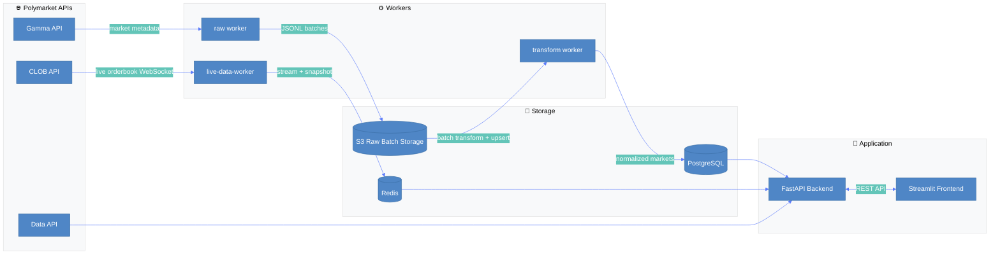
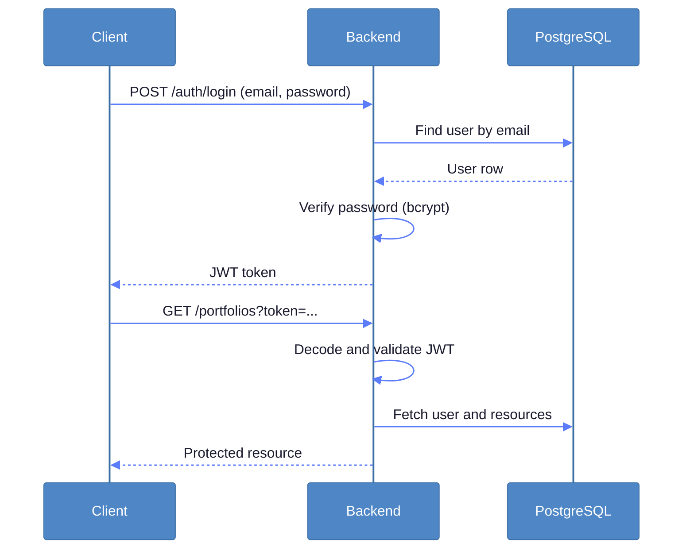
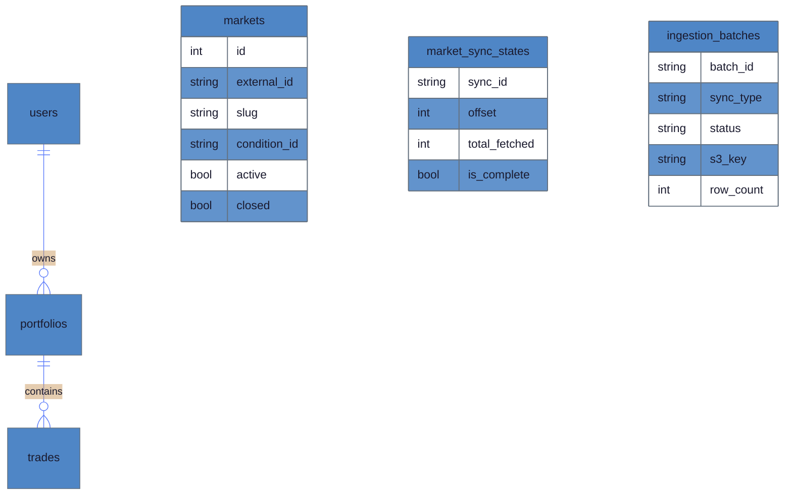

# Polymarket Paper Trading Platform

[](https://github.com/Mathieuja/Polymarket---Mise-en-production/actions/workflows/ci.yml)

A paper trading platform for [Polymarket](https://polymarket.com) prediction markets. Browse real markets, execute simulated trades, and track portfolio performance without risking real money.

_Why paper trading?_

1. Practice without risk: test your prediction skills and trading strategies before committing real funds.
2. Compliance-friendly learning: access a realistic market experience in contexts where real-money participation may be restricted.
3. Product and data engineering playground: work with real market metadata, live orderbook streams, and a production-style ingestion pipeline.

---

## System Overview



| Service | Port | Role |
|---------|------|------|
| Frontend (Streamlit) | 8501 | User interface |
| Backend (FastAPI) | 8000 | REST API |
| PostgreSQL | 5432 | Persistent relational storage |
| Redis | 6379 | Live orderbook cache + stream |
| Worker (raw mode) | — | Fetches markets from Gamma and stores raw JSONL to S3 |
| Worker (transform mode) | — | Reads raw batches, transforms, upserts into PostgreSQL |
| Worker (live data mode) | — | Streams orderbook updates from CLOB to Redis |

## Project Structure

```text
Polymarket---Mise-en-production/
├── app/
│   ├── backend/
│   │   ├── api/
│   │   │   ├── main.py                 # FastAPI app startup, routers, CORS
│   │   │   ├── routers/                # auth, users, markets, portfolios, market-stream, debug
│   │   │   ├── services/               # market + portfolio business logic
│   │   │   ├── schemas/                # API request/response contracts
│   │   │   ├── dependencies/           # auth dependencies (current user, token)
│   │   │   └── core/                   # security helpers, config
│   │   ├── Dockerfile
│   │   └── requirements.txt
│   ├── frontend/
│   │   ├── main.py                     # Streamlit app entry and page routing
│   │   ├── views/                      # login, trading, portfolio, history, metrics, account
│   │   ├── utils/                      # API client, session state, styles, UI helpers
│   │   ├── configs/fixtures/           # mock data fixtures
│   │   ├── Dockerfile
│   │   └── requirements.txt
│   ├── backend_old/                    # Legacy implementation snapshot
│   └── frontend_old/                   # Legacy implementation snapshot
├── worker/
│   ├── app/
│   │   ├── main.py                     # Worker mode dispatch (raw / transform / live_data)
│   │   └── services/
│   │       ├── raw_ingestion_worker.py
│   │       ├── transform_loader_worker.py
│   │       ├── live_data_worker.py
│   │       ├── market_sync_utils.py
│   │       └── s3_client.py
│   ├── Dockerfile
│   └── requirements.txt
├── shared/
│   ├── app_shared/
│   │   ├── config/settings.py
│   │   ├── database/                   # SQLAlchemy models, sessions, lightweight migrations
│   │   └── schemas/
│   ├── pyproject.toml
│   └── README.md
├── tests/
│   ├── unit/
│   └── integration/
├── docs/
│   └── api/openapi.yaml
├── docker-compose.yml
└── DEVELOPMENT.md
```

---

## 1. Running the Application

> **Note**: The project now includes a complete multi-service Docker setup (frontend, backend, database, Redis, workers). Local non-Docker run is also possible for frontend/backend development.

### Prerequisites

- Docker and Docker Compose v2+
- Python 3.10+ (for local development and tests)
- Git
- Optional: PostgreSQL client / Redis GUI / S3-compatible local service (for pipeline inspection)

### Step-by-step setup (Docker)

**1. Clone the repository**

```bash
git clone <repository-url>
cd Polymarket---Mise-en-production
```

**2. Create environment file**

Create a `.env` file in the project root.

Minimal example:

```env
# Core app
BACKEND_MODE=api
API_URL=http://localhost:8000
APP_NAME=Polymarket Paper Trading
JWT_SECRET=change-me-please

# PostgreSQL
POSTGRES_DB=polymarket_db
POSTGRES_USER=polymarket_user
POSTGRES_PASSWORD=polymarket_password

# Redis
REDIS_HOST=redis
REDIS_PORT=6379

# Worker / S3 raw ingestion
S3_RAW_BUCKET=your-bucket-name
S3_RAW_PREFIX=polymarket/raw
AWS_REGION=eu-west-3
AWS_ACCESS_KEY_ID=...
AWS_SECRET_ACCESS_KEY=...

AWS_ENDPOINT=minio.lab.sspcloud.fr


# S3_ENDPOINT_URL=http://minio:9000

#necessary polymarket clob api key
API_KEY=0xc29abf02109df1a522bcb290f44aae33381723ebbdd98d1f5eefdc36800f71cf
```

**3. Build containers**

```bash
docker compose build
```

**4. Start all services**

```bash
docker compose up
```

**5. Verify setup**

| Service | URL | Expected |
|---------|-----|----------|
| Health check | http://localhost:8000/health | `{"status":"ok"}` |
| API docs (Swagger) | http://localhost:8000/docs | Interactive API documentation |
| Frontend | http://localhost:8501 | Streamlit interface |
| PostgreSQL | localhost:5432 | Database `polymarket_db` reachable |
| Redis | localhost:6379 | `PING` returns `PONG` |

### Local development (without Docker)

Install dependencies:

```bash
pip install -e ./shared
pip install -r app/backend/requirements.txt
pip install -r app/frontend/requirements.txt
pip install -r worker/requirements.txt
```

Run backend:

```bash
uvicorn app.backend.api.main:app --reload --port 8000
```

Run frontend:

```bash
streamlit run app/frontend/main.py
```

### Running tests

```bash
# Run all tests
python -m pytest

# Run unit tests only
python -m pytest tests/unit -v

# Run with coverage
python -m pytest --cov=app tests/
```

---

## 2. How to Use the App

This section mirrors the current Streamlit interface and its default navigation flow.

### 2.1 Login and account creation

- Open the frontend at http://localhost:8501.
- Use the Login page to sign in with email and password.
- If needed, create an account using the Register flow.
- On successful login, the app stores the JWT token in session state and unlocks all pages.

### 2.2 Main navigation

After authentication, the sidebar exposes five main pages:

1. Trading: browse markets, inspect details, refresh orderbook, execute paper trades.
2. Portfolio: create and manage portfolios, inspect positions and balances.
3. History: review executed trades and account activity.
4. Metrics: visualize portfolio-level and position-level performance.
5. Account: view user profile information and change password.

### 2.3 Trading page

- Browse and filter available markets.
- Open a market detail block.
- Fetch live orderbook levels via the market-stream endpoints.
- Select portfolio, side, outcome token, and quantity.
- Execute paper trades based on available orderbook levels.

### 2.4 Portfolio page

- Create a portfolio with an initial balance.
- View portfolio details, positions, and valuation.
- Navigate to trading to modify positions.
- Delete a portfolio when no longer needed.

### 2.5 Metrics page

- Choose a portfolio.
- Inspect mark-to-market and PnL evolution.
- Drill down by position to understand contribution to performance.

### 2.6 History page

- Review historical trades and transactions.
- Explore records with built-in filtering in the UI.

### 2.7 Account page

- Check account details.
- Change password securely via the authenticated API endpoint.

---

## 3. How the App Works

### Backend (FastAPI)

#### Authentication

The backend uses JWT-based authentication with bcrypt password hashing.

| Setting | Value |
|---------|-------|
| Password hashing | `passlib[bcrypt]` |
| Token algorithm | HS256 |
| Default token expiry | 60 minutes |
| Token transport | Query parameter (`?token=...`) |

Protected endpoints validate the token, resolve the current user, and apply access control.



#### Data validation and domain model

- FastAPI route contracts are defined in `app/backend/api/schemas/`.
- Shared SQLAlchemy entities and migrations are centralized in `shared/app_shared/database/`.
- Main persisted entities include users, portfolios, trades, markets, market sync states, and ingestion batches.

#### Database architecture

The current project uses one PostgreSQL database with logical separation at table level.



Migrations are run at startup through the shared migration runner.

#### Polymarket API integration

Three Polymarket endpoints are integrated:

| API | Base URL | Main usage |
|-----|----------|------------|
| Gamma | `https://gamma-api.polymarket.com` | Market metadata ingestion |
| CLOB | `https://clob.polymarket.com` + WS | Price history and live orderbook |
| Data | `https://data-api.polymarket.com` | Open interest queries |

The API docs are available at http://localhost:8000/docs when backend is running.

### Workers

The worker container supports three execution modes via `WORKER_MODE`.

#### raw worker (`WORKER_MODE=raw`)

- Fetches market batches from Gamma.
- Stores raw JSONL files to S3-compatible storage.
- Tracks progress in `market_sync_states`.
- Creates ingestion records in `ingestion_batches` with status `raw_stored`.

Default behavior:
- Incremental sync interval: 30 minutes.
- Full sync interval: 24 hours.
- Batch size: 200 records.

#### transform worker (`WORKER_MODE=transform`)

- Polls pending raw batches (`raw_stored` / `failed`).
- Reads JSONL from S3.
- Normalizes data through DuckDB + Python transform helpers.
- Upserts markets into PostgreSQL.
- Marks batch status as `loaded` or `failed`.

#### live-data worker (`WORKER_MODE=live_data`)

- Connects to CLOB market websocket.
- Writes live messages into Redis stream (capped list).
- Maintains Redis JSON snapshot of orderbooks keyed by asset id.
- Listens to control commands on Redis pub/sub channel to start/stop assets.

---

## 4. Implementation Notes and Deployment TODOs

### Security hardening before production

- Replace development JWT secret with a strong secret and rotate safely.
- Restrict CORS origins in backend (currently permissive).
- Review query-parameter token transport and consider migration path to Authorization headers for non-Streamlit clients.

### Operational hardening

- Validate S3 lifecycle and retention strategy for raw JSONL batches.
- Add monitoring and alerting on worker lag and failed ingestion batches.
- Add backup and restore strategy for PostgreSQL.

### API and frontend behavior

- Live orderbook in Streamlit is driven by backend endpoints backed by Redis (start/stop stream, fetch snapshot/latest).
- For production-grade UX, a dedicated frontend framework with native realtime patterns can still be considered.

### Testing gaps

Current tests validate core config/math pieces and selected component behavior. Additional coverage is recommended for:

- Trading edge cases (insufficient balance, invalid side/outcome transitions).
- Concurrent portfolio updates and race conditions.
- Worker recovery scenarios (S3 failures, partial transforms, Redis disconnects).
- End-to-end ingestion pipeline and API integration tests.

---

## License

MIT License